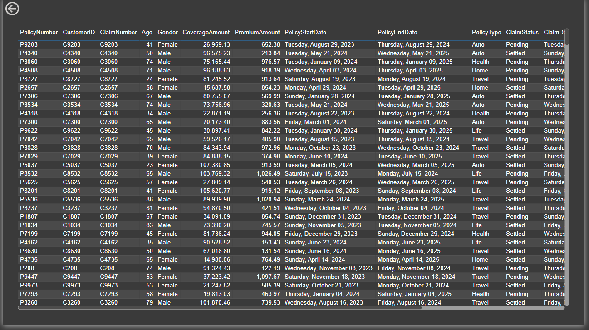

# Insurance Customer Feedback Analysis

## 📊 Project Overview
This project focuses on analyzing insurance customer feedback data to extract meaningful insights. Using Power BI, an interactive and insightful dashboard was created to visualize key metrics and trends from the dataset.

---

## 📁 Dataset Details
- **Source:** Provided CSV file containing 10,000 records and 7 columns.
- **Columns:**
  - `Customer_ID`: Unique identifier for each customer.
  - `Age`: Age of the customer.
  - `Gender`: Gender of the customer.
  - `Policy_Type`: Type of insurance policy (Vehicle, Life, Health).
  - `Premium_Amount`: Premium amount paid by the customer.
  - `Coverage_Amount`: Coverage amount of the policy.
  - `Claim_Status`: Status of the claim (Pending, Accepted, Rejected).

---

## 📊 Dashboard Visuals
### 1. Main Dashboard 
- Overview of total claim amount, coverage amount, and premium amount.
- Count of active and inactive claim statuses.
- Claims distribution by age group and policy type.

### 2. Feedback Count Analysis 
- Analysis of customer feedback distribution.
- Identification of key feedback categories and their frequencies.

### 3. Detailed Table View 
- Detailed claim status by policy type.
- Filtered insights to analyze claim outcomes effectively.

---

## 🔧 Tools & Technologies Used
- **Power BI:** For data visualization and dashboard creation.
- **Excel:** Data cleaning and preprocessing.
- **Python (optional):** For advanced data analysis.

---

## 💡 Insights
- Identified trends in claim approvals and rejections.
- Analyzed premium amounts and coverage across different age groups.
- Explored the relationship between policy types and claim outcomes.

---

## 🚀 Future Enhancements
- Implement advanced analytics using Python for deeper insights.
- Create a more interactive and dynamic dashboard for real-time data updates.

---

## 🗂️ Project Structure
- `InsuranceData.csv`: Raw dataset used for analysis.
- `Main Dashboard.png`: Snapshot of the main dashboard.
- `Feedback Count.png`: Visualization of feedback count.
- `Table.png`: Detailed view of claim status by policy type.

---

## 📬 Contact
For any queries or suggestions, feel free to reach out!

---

